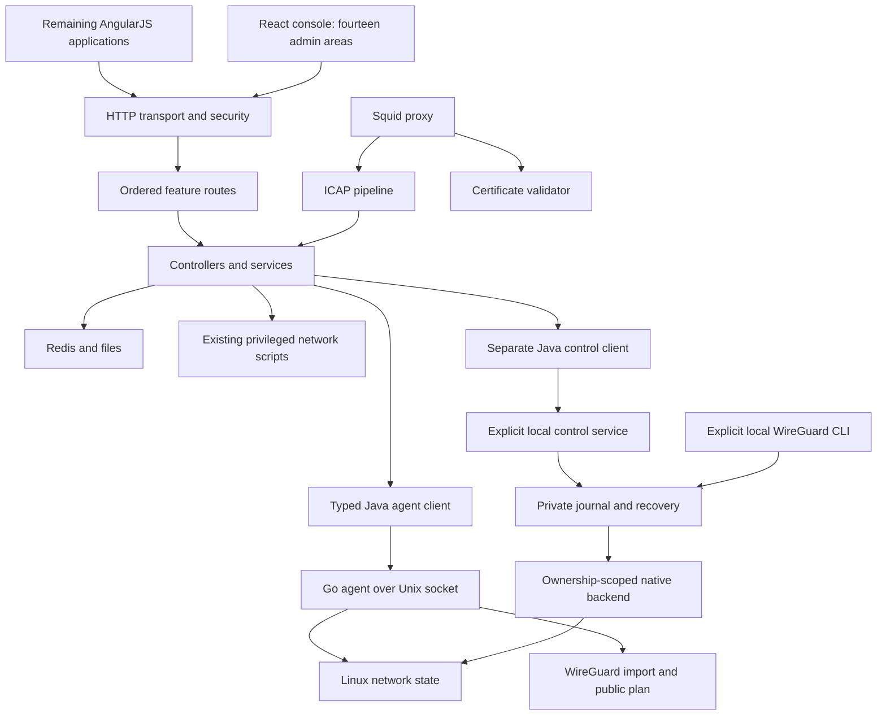

# Architecture and code map

## Current system

The appliance is a multi-process product, not just the Java server. The HTTP API
and ICAP backend share the `eblocker-icapserver` JVM; persistent data uses Redis
and files. Squid, certificate validation, DNS services and privileged network tools
have separate lifecycles. Debian packaging installs configuration and scripts that
are part of the product contract.

## HTTP route boundary

`EblockerHttpsServer` owns serialization, preprocessors, listener lifecycle and TLS
context changes. It receives an `EblockerRoutes` composition root instead of dozens
of controllers. The composition root preserves the complete original registration
order and appends the static-file catch-all last.

| Module | Route ownership |
| --- | --- |
| AuthenticationRoutes | Login, tokens, password reset and password controls |
| DevicesRoutes | Device configuration, dashboards and user-agent cloaking |
| NetworkRoutes | Network setup, DNS, connectivity and the authenticated agent bridge |
| VpnRoutes | Existing OpenVPN, mobile connection checks and Tor |
| ProtectionRoutes | HTTPS, blocking, allowlists, application modules and statistics |
| FamilyRoutes | Users, parental controls and filter lists |
| DiagnosticsRoutes | Recording, events and diagnostic reports |
| SystemRoutes | Startup status, updates, time, settings, backup and tasks |
| ExperienceRoutes | Setup, registration, messages, public pages and redirects |

These are route declarations, not new implementations of the underlying services.
The route name is security-sensitive because `SecurityProcessor` and `AppContext`
interpret it. Flags such as `NO_AUTHENTICATION_REQUIRED` must not be treated as
unconditionally public: token/context checks still apply. JSON contracts preserve
all builder calls, including flags and serialization settings. The original 360 routes
remain frozen. Additions for cookie sessions, narrow settings PATCHes, agent
observation/validation and WireGuard management are recorded separately in
`http-routes-additions.json`. The four session entry points validate HTTPS origin,
CSRF and session state themselves; management routes retain ADMINCONSOLE checks.

Each module receives only its needed controllers through constructor injection.
The composition class is the sole location for route precedence. Neither a new
controller service locator nor a generic command execution interface was added.

## Boundaries implemented in this stage

- `JedisDataSource` remains a compatibility facade. `JedisDeviceRepository` owns device hashes;
  `JedisNetworkConfiguration` owns network/tunnel settings; `JedisEntityRepository`
  owns JSON entities, sequences and historic key aliases. Stored keys, field formats
  and fallback behavior remain unchanged. Global UI/filter settings still live in
  the facade; this is not a new database model.
- `DeviceSettingsPatch` accepts only name, protection enablement, ad/tracker/malware
  flags and device HTTPS. Infrastructure devices are protected; enablement changes
  conflict with an active pause. `DeviceService` serializes persistence/cache commits
  and rejects refresh snapshots from an older cache version; listeners run outside
  that lock. This fixes stale refresh replacement without introducing a transaction
  across Redis, mutable domain objects, listeners and network operations.
- `PasswordUtil` writes versioned Argon2id hashes with a fixed cost profile. Legacy
  console passwords are rehashed after successful verification. Credential operations
  are synchronized and hashing concurrency is bounded. `JsonWebTokenHandler` adds a
  process-local administrator epoch: successful password enable/change/removal/reset
  invalidates existing `ADMINCONSOLE`, `CONSOLE` and `ADMINDASHBOARD` tokens, including
  renewal attempts. A server restart already replaces the signing secret. On HTTPS, cookie sessions
  keep tokens on the server behind an HttpOnly, Secure,
  SameSite=Strict cookie. Explicit origin/CSRF checks cover the console; logout
  revokes the current session family and prevents late login/renewal resurrection.
  HTTP development retains the in-memory Bearer adapter. This is not an
  administrator-wide session inventory/revocation product.
- PIN verification reads current persistence and upgrades verified legacy hashes
  through atomic `compareAndSetUserPin`, preserving concurrent role/profile edits.
  Other user mutations use whole-user CAS and publish copied cache values only
  after persistence succeeds. A cache version rejects obsolete refresh snapshots.
- Fourteen React areas cover devices, protection, HTTPS, network/DNS editors,
  WireGuard management, security, system, family CRUD, existing VPN/Tor, updates,
  backup, diagnostics and the feature catalog. Narrow writes use the existing APIs, explicit confirmation where appropriate, fresh reads
  and result readback. Family management checks administrator/parent authority and
  applies bonus/filter changes to the latest profile under the same service lock,
  publishing a copied profile only after persistence succeeds.
- The catalog assigns all 85 original Settings states exactly once and exposes
  35 visible entries in six categories. Retention tests check local link destinations,
  component/template presence and all five original web entry points. This is a
  static removal guard, not a runtime equivalence test or permission to remove Angular.
- `libs/persistence` is a separate Java 17 offline migration module. Its versioned
  logical Redis format maps binary string/hash/set/list/sorted-set data into SQLite
  `STRICT` tables, preserving absolute expiry and raw double score bits. Imports use
  WAL, a single transaction, integrity checks and a canonical read-back digest;
  existing destinations cannot be replaced. CLI audit/export are read-only database
  operations. The RDB converter now accepts a bounded, checksum-verified subset of
  offline versions 5–12 through a resource-limited worker JVM. It rejects unsupported
  features for the whole file and preserves source provenance. The live runtime
  adapter is not implemented; the server and other Redis consumers are unchanged. See the
  [format, inventory and CLI](../libs/persistence/README.md).

## Native network boundary

`NetworkAgentController` requires an authenticated ADMINCONSOLE context. Its two
operations are status observation and WireGuard validation. `NetworkAgentClient`
accepts only the versioned public response types; unknown fields, mutable-state claims
and malformed responses are rejected. Agent absence produces HTTP 503, never synthetic
capabilities. Exceptions containing source snippets are not forwarded or logged.

The configured filesystem socket is `/run/eblocker/network-agent.sock`. Java 17 NIO
uses AF_UNIX only, a three-second exchange deadline, a 16 KiB header ceiling and
512 KiB response-body ceiling. Explicit Content-Length and connection termination
are required; chunked, encoded, duplicate or inconsistent framing is rejected.
Profiles are bounded to 64 KiB decoded UTF-8; the JSON envelope permits escaping.
The Go package grants the existing server user access through a supplementary group.
No TCP endpoint or shell-command bridge is introduced.

The HTTP agent reads its own Linux network namespace via native interface/netlink
APIs. Its status contract remains read-only and WireGuard validation returns public
metadata with `applied=false` and `killSwitchActive=false`. No operation of this
observation service grants kernel-write capabilities or stores a supplied profile.

The separate local `eblocker-wireguard` CLI and `eblocker-network-control` service
combine `libs/wireguard/manager` with the native `wgkernel` adapter. Neither changes
the observation daemon's privileges. The control service has its own system user,
CAP_NET_ADMIN boundary and private `/run/eblocker-network-control/control.sock`.
Each connection must match the configured Java UID and primary GID via SO_PEERCRED;
filesystem group access alone is insufficient. The package leaves this service
disabled and does not create its explicit enable marker.

`WireGuardControlController` and its separate typed Java client expose authenticated
profile import/list/status/connect/disconnect/cancel/delete actions to React. JSON
is bounded and strictly decoded; fixed errors never reflect secret-bearing input
or backend exception text. Shared Go-produced contract fixtures are consumed by Java
and React. Only public profile metadata is returned. Imported sources remain in
private 0600 files until explicit deletion; temporary runtime configurations are
removed on disconnect. Journals authorize only owned resources and make interrupted
apply/removal recoverable. Files are not encrypted.

The native adapter uses RTNETLINK, WireGuard Generic Netlink and nftables without
shell commands. Split tunnels use owned interfaces/routes. Full tunnels journal a
canonical `policy.Plan` with their table, socket mark, both address-family policy
rules, exact outer-UDP endpoint exemptions and explicit local management networks.
The owned firewall is committed atomically before interface/routing mutation and
removed last during cleanup. Current protection is reported only after complete
native routing, mark, endpoint and firewall readback. Historical journal flags
cannot provide that claim; malformed or incomplete ownership prevents cleanup.

Standard DNS traffic outside the tunnel is blocked with narrow LAN/DHCP/NDP
exceptions. Profiles requesting resolver configuration, hostname/roaming endpoints,
unsupported routing or unhandled topology are rejected before apply. A valid
interface and policy do not prove a handshake, resolver availability or reachability.
Existing OpenVPN/Tor and the legacy network-control paths remain in place.

See [control protocol](../apps/network-agent/internal/controlapi/README.md),
[policy semantics](../libs/wireguard/policy/README.md) and
[lifecycle/recovery](../libs/wireguard/manager/README.md). Unit tests use controlled
kernel drivers, real private temporary files and semantic packet checks. The
separate Unix-socket and privileged namespace integration gates are prepared;
no successful native CI, real tunnel, DNS/IPv6 leak, systemd or hardware execution
is inferred from their presence. HTTP/JSON remains the implemented protocol;
Protobuf is not introduced.

## Remaining structural boundaries

`EblockerModule` still contains substantial Guice/lifecycle composition;
`EblockerServerApp` retains startup/process orchestration. Large application services,
the legacy web build, Redis/file persistence and installed network scripts remain
migration work. See the current [code map](CODE_MAP.md).

## Target direction from the earlier plan

Preserve the previously requested native WireGuard provider, modern multilingual
UI, local operation, Java control plane, typed Go network agent, IPv4/IPv6 support,
transactional update/rollback and eventual Redis/legacy removal. Current
implementation covers the React slices, read-only HTTP agent, separately gated WireGuard control/lifecycle and
offline RDB/SQLite migration described above. Full network-policy
coverage, live database replacement and transactional appliance upgrades remain open.
Exact dependency versions must be verified when each replacement is built.

Migration order is baseline and characterization, build/security repairs,
vertical feature replacements, data migration, network/PKI/VPN replacements,
packaging and upgrade verification, then removal of the old path. The previous
plan's reference was `8f4ce40d8ece552ab91e8e6c3b376fb6866b481f`; this task explicitly
uses the newer requested branch tip pinned in `sources.lock.json`.

## Monorepo build boundaries

See [ADR 0002](adr/0002-monorepo-and-maintained-build.md) for integration details
and [the code map](CODE_MAP.md) for package counts and entry points.

The root Maven reactor builds the local parent, cryptography, registration, offline
SQLite migration, ICAP/HTTP forks, server, certificate validator, OS configuration,
UI and filter-list compiler. Bootstrap is an explicit profile because its architecture/environment
must be selected. Native C/Ruby/Squid components retain their own build systems
inside the same repository; they are not implicitly installed on the build host.

UI feature factories receive shared state explicitly. The shell receives the
same state-array reference and task-state object that the composition registers;
resolves therefore update the registered objects. Regression tests exercise these
closures as well as comparing the frozen route definitions.

The React slices and their security, package and test boundaries are described in
[console migration](development/console-migration.md). It is installed on `/next/`;
remaining AngularJS features are reached through `/settings/`.
